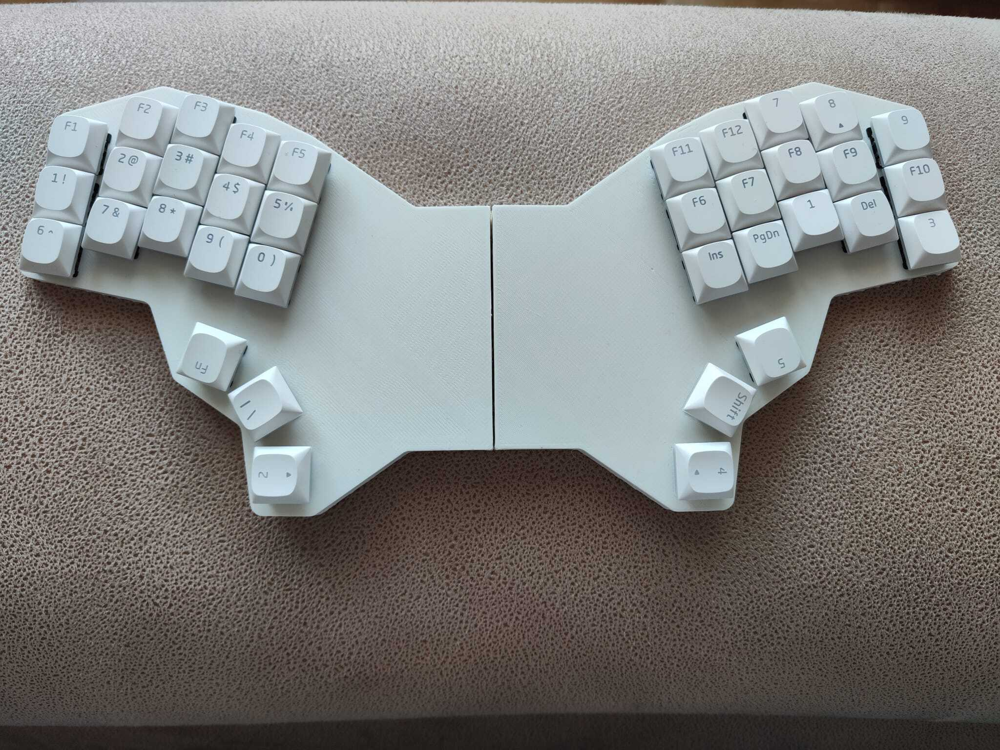

# Ergogen how-to

Based on [ergogen](https://github.com/ergogen/ergogen) and flatfootfox tutorials:
[units](https://flatfootfox.com/ergogen-part1-units-points/)\
[outlines](https://flatfootfox.com/ergogen-part2-outlines/)\
[cases_3d](https://flatfootfox.com/ergogen-part4-footprints-cases/)\
Still to cover pcb:\
[pcbs](https://flatfootfox.com/ergogen-part3-pcbs/) & [finale](https://flatfootfox.com/ergogen-part5-kicad-firmware-assembly/)

Visualization while building yml config is better done on [unofficial](https://ergogen.cache.works/) web tool.