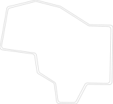

# Ergogen how-to


Based on [ergogen](https://github.com/ergogen/ergogen) and flatfootfox tutorials:\
[units](https://flatfootfox.com/ergogen-part1-units-points/)\
[outlines](https://flatfootfox.com/ergogen-part2-outlines/)\
[cases_3d](https://flatfootfox.com/ergogen-part4-footprints-cases/)\
Still to cover pcb:\
[pcbs](https://flatfootfox.com/ergogen-part3-pcbs/) & [finale](https://flatfootfox.com/ergogen-part5-kicad-firmware-assembly/)

Visualization while building yml config is better done on [unofficial](https://ergogen.cache.works/) web tool.

## [Absolem](https://zealot.hu/absolem/)

Best to start with simplified Absolem keyboard (found in web tool)


```yml
points:
  zones:
    matrix:
      columns:
        pinky:
        ring:
          key.splay: -5
          key.origin: [-12, -19]
          key.stagger: 12
        middle:
          key.stagger: 5
        index:
          key.stagger: -6
        inner:
          key.stagger: -2
      rows:
        bottom:
        home:
        top:
    thumbfan:
      anchor:
        ref: matrix_inner_bottom
        shift: [-7, -19]
      columns:
        near:
        home:
          key.spread: 21.25
          key.splay: -28
          key.origin: [-11.75, -9]
        far:
          key.spread: 21.25
          key.splay: -28
          key.origin: [-9.5, -9]
      rows:
        thumb:
  rotate: -15
  mirror:
    ref: matrix_pinky_home
    distance: 223.7529778
```
## Details:

### **Matrix** -> Rows & Columns:
```yml
...
matrix:
    columns:
        # so it's 5 colums
        # 4 per each finger 
        # +5th called inner
        pinky:
        ring:
        # change splay/origin/stagger to understand what they do
        key.splay: -5
        key.origin: [-12, -19]
        key.stagger: 12
        middle:
        key.stagger: 5
        index:
        key.stagger: -6
        inner:
        key.stagger: -2
    rows:
        # and it has 3 rows
        bottom:
        home:
        top:
...
```
One can reference positions of matrix 2d points to build shapes via matrix_**column**_**row** ex. "ref: matrix_middle_home"

### **Matrix** -> Thumbfan:

```yml
...
matrix:
...
    thumbfan:
    # here is already example of reference
    # it's saying based on which point thumb fan should be placed
      anchor:
        ref: matrix_inner_bottom
        # "shifting" in 2d space by x, y
        shift: [-7, -19]
    # and then describe thumb fan via matrix
      columns:
      # has 3 columns
        near:
        home:
        #again best to manipulate and visualize this to understand what they do
          key.spread: 21.25
          key.splay: -28
          key.origin: [-11.75, -9]
        far:
          key.spread: 21.25
          key.splay: -28
          key.origin: [-9.5, -9]
      rows:
      # has 1 row
        thumb:
...
```

### Rotate & Mirror
```yml
...
# gives a rotation to half of a keyboard
  rotate: -15
# and then mirror left half to create right
  mirror:
    # mirror around what (again using ref)
    ref: matrix_pinky_home
    # how far (from pinky to pinky)
    distance: 223.7529778
```

## Units
Only unit we used is how far mirroring is done (223.7529778), but still generated keyboard looks good? Ergogen internally specifies default units (in web tool one can examine units.yml and points.yml files).\
Units are in **Millimeters** (if not specified differently)

By default Ergogen offers some units for Chock and Standard MX style switches/keycaps (details can be found at [units](https://flatfootfox.com/ergogen-part1-units-points/))\
This keyboard is based on [gatheron mx low profile switches](https://www.gateron.co/products/gateron-low-profile-mechanical-switch-set)which are a bit different in dimension so Units will be specified from scratch:

```yml
units:
# keycap dimension x and y
  kx: 18
  ky: 18
  pad: 0.2
# spread (in +-x direction)
  ks: kx + pad
# padding (in +-y direction)
  kp: ky + pad
# padding, change this to find right setting for your 3d printer
  sw_pad: 0.2
# switch dimensions x and y
  sx: 14 + sw_pad
  sy: 14 + sw_pad
points:
  zones:
    matrix:
      key:
        # spread is in X direction
        spread: 1ks
        # padding is in Y direction
        padding: 1kp
        # it's possible to do math ops like 1.5ks (1.5 * ks) or any other math op
      columns:
...
```

Cartesian coordinate system:


Everything so far connected together.
## **Keys positions**
```yml
units:
# keycap dimension
  kx: 18
  ky: 18
# spread/padding
  pad: 0.2
  ks: kx + pad
  kp: ky + pad
# switch dimension
  sw_pad: 0.2
  sx: 14 + sw_pad
  sy: 14 + sw_pad
points:
  zones:
    matrix:
      key:
        spread: 1ks
        padding: 1kp
      columns:
        pinky:
        ring:
          key.splay: -5
          key.origin: [-12, -19]
          key.stagger: 12
        middle:
          key.stagger: 5
        index:
          key.stagger: -6
        inner:
          key.stagger: -2
      rows:
        bottom:
        home:
        top:
    thumbfan:
      anchor:
        ref: matrix_inner_bottom
        shift: [-7, -19]
      columns:
        near:
        home:
          key.spread: 21.25
          key.splay: -28
          key.origin: [-11.75, -9]
        far:
          key.spread: 21.25
          key.splay: -28
          key.origin: [-9.5, -9]
      rows:
        thumb:
  rotate: -15
  mirror:
    ref: matrix_pinky_home
    distance: 223.7529778
```

Some updates to keys position:
- mirror distance:
```diff
mirror:
  ref: matrix_pinky_home
- distance: 223.7529778
+ distance: 284
```
- rotate:
```diff
- rotate: -15
+ rotate: -10
```
- ring 
```diff
ring:
  key.splay: -5
- key.origin: [-12, -19]
+ key.origin: [-12, -16]
- key.stagger: 12
+ key.stagger: 11
```
- thumbfan:
```diff
thumbfan:
       anchor:
         ref: matrix_inner_bottom
-        shift: [-7, -19]
+        shift: [-10, -30]
       columns:
         near:
+          key.splay: -6
         home:
-          key.spread: 21.25
-          key.splay: -28
-          key.origin: [-11.75, -9]
+          key.spread: 19
+          key.splay: -38
+          key.origin: [-10, -9]
         far:
-          key.spread: 21.25
-          key.splay: -28
+          key.spread: 19
+          key.splay: -32
           key.origin: [-9.5, -9]
       rows:
         thumb:
```
P.S. My hands are shifted by 1 column to the outside.\
More natural position for thumbs I would say would be "shift: [-3, -30]" for regular person instead of mine "shift: [-10, -30]".

## **Keys positions with personal changes**


Basic config: [part1_basics.yml](./part1_basics.yml)


# Outlines (Shapes)

Next thing to do it to draw some shape around keys. This is basis for building 3d printed case and PCBs later on. Also, it's not only about drawing shapes around keys, it's also possible to visualize switch positions. Notice how size is changed to sx, sy (switch size + padding)


```yml
...
outlines:
  switches:
    - what: rectangle
      where: true
      size: [sx,sy]
```

How to visualize this in web tool? On right side click preview next to switches.dxf


Drawing around:

## Box

One could try to draw a box around by referencing pinky positions like:
```yml
...
outlines:
...
  box:
    - what: polygon
      operation: stack
      points:
        - ref: matrix_pinky_top
        - ref: matrix_pinky_bottom
        - ref: mirror_matrix_pinky_bottom
        - ref: mirror_matrix_pinky_top
```
Defining a couple more simple shapes for debugging proposes:
```yml
...
outlines:
...
# same as keyboard layout (notice minus padding)
raw:
    - what: rectangle
      where: true
      size: [kx,ky]
...
# useful to debug one on top of other
combo_box_raw:
    - name: box
    - operation: stack
      name: raw
```


Not really desired behavior. 

Fix X direction
```yml
...
outlines:
...
  box:
    - what: polygon
      operation: stack
      points:
        - ref: matrix_pinky_top
          # ks is from units, can be combine with mathops
          # notice how -ks here
          shift: [-ks,0]
        - ref: matrix_pinky_bottom
          shift: [-ks,0]
          # on mirror is inverted (still -ks)
          # one would assume here should be +ks
        - ref: mirror_matrix_pinky_bottom
          shift: [-ks,0]
        - ref: mirror_matrix_pinky_top
          shift: [-ks,0]
```


Fix Y direction
```yml
...
outlines:
...
  box:
    - what: polygon
      operation: stack
      points:
        - ref: matrix_pinky_top
          shift: [-ks,ky]
        - ref: matrix_pinky_bottom
          shift: [-ks,-100]
        - ref: mirror_matrix_pinky_bottom
          shift: [-ks,-100]
        - ref: mirror_matrix_pinky_top
          shift: [-ks,ky]
```


Thats the basics, now one has to improve quality by adding more points. 

**TIP:** To create a 3d printed case later on, one has to create 2 similar shapes, one a little bigger then the other. These shapes are then combine with **"operation: subtract"**.\
Easiest way to achive this is to add one more variable in the mix, call it z: 0. Now follow simple rules:
1) If negative shift add: +z
2) If positive shift add: -z
3) If zero shift add: +z
After, one can define a new variable "side: 2" and replace +z & -z with +side & -size.\
There will be some small work to be done (change some from + to - and fix some corners by making 0.2side or 0.3side). The above 3 step heuristic is gonna give 80% correctness and it's very simple.

**3D print Tip:** Most 3d printer wont be able to create both cases at once, keyboard must be split in half. So, when creating a outlines just do it around left part and not right - this makes life easer in Thinkercad.

## Case (Polygon with a lot of points)


```yml
outlines:
  switches:
    - what: rectangle
      where: true
      size: [sx,sy]

  case:
    - what: polygon
      operation: stack
      points:
        # left
        - ref: matrix_pinky_top
          shift: [-sx+z,0.8sy-z]
        - ref: matrix_pinky_bottom
          shift: [-sx+z,-sy+z]
        - ref: matrix_middle_bottom
          shift: [0+z,-1.8sy+z]
        # thumb
        - ref: thumbfan_near_thumb
          shift: [-sx+z,-sy+z]
        - ref: thumbfan_home_thumb
          shift: [0+z,-sy+z]
        - ref: thumbfan_far_thumb
          shift: [sx-z,-sy+z]
        - ref: thumbfan_far_thumb
          shift: [sx-z, sy-z]
        # bottom middle 
        - ref: thumbfan_far_thumb
          shift: [-sx+z, 2sy-z]
        - ref: thumbfan_far_thumb
          shift: [-sx+z, 4.5sy-z]
        # top middle 
        - ref: thumbfan_far_thumb
          shift: [-7sx+z, 4.5sy-z]   
        - ref: matrix_inner_top
          shift: [2sx-z, 0.5sy-z]
        - ref: matrix_index_top
          shift: [0+z, 1.4sy-z]
        - ref: matrix_ring_top
          shift: [0+z, 1.3sy-z]
      # round corners
      fillet: 4
          
  combo_box_raw:
    - name: case
    - operation: stack
      name: switches
```

Finally to cut out the switch holes:


```yml
outlines:
  ...
  case_cut_switches:
    - name: case
    - operation: subtract
      name: switches
```

Lets define new unit "side:0". New shape case_small will use these to create case sides:



Manual adjustments of case_small (beside replacing +z => +side & -z => -side)
```diff
case_small:
         - ref: thumbfan_near_thumb
           shift: [-sx+side,-sy+side]
         - ref: thumbfan_home_thumb
-          shift: [0+side,-sy+side]
+          shift: [0+0.2side,-sy+side]
         - ref: thumbfan_far_thumb
           shift: [sx-side,-sy+side]
         - ref: thumbfan_far_thumb
           shift: [sx-side, sy-side]
         # bottom middle 
         - ref: thumbfan_far_thumb
-          shift: [-sx+side, 2sy-side]
+          shift: [-sx-side, 2sy-side]
         - ref: thumbfan_far_thumb
-          shift: [-sx+side, 4.5sy-side]
+          shift: [-sx-side, 4.5sy-1.5side]
         # top middle 
         - ref: thumbfan_far_thumb
-          shift: [-7sx+side, 4.5sy-side]   
+          shift: [-7sx+side, 4.5sy-1.5side]   
         - ref: matrix_inner_top
-          shift: [2sx-side, 0.5sy-side]
+          shift: [2sx-0.2side, 0.5sy-side]
         - ref: matrix_index_top
-          shift: [0+side, 1.4sy-side]
+          shift: [0-0.2side, 1.4sy-side]
         - ref: matrix_ring_top
-          shift: [0+side, 1.3sy-side]
+          shift: [0+0.2side, 1.3sy-side]
       # round corners
       fillet: 4
```

Config with outlines: [part2_with_outlines.yml](./part2_with_outlines.yml)